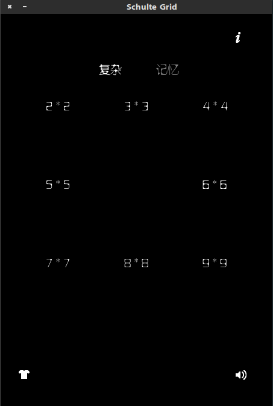
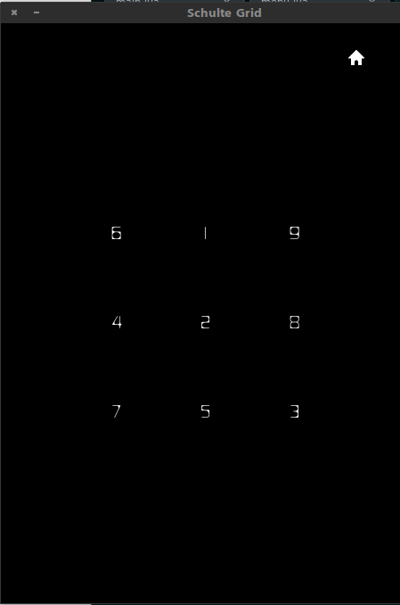

# Brain Train

## 1. Schult Grid

### 简介

舒尔特表是全世界最简单、最有效也是最科学的注意力训练方法。在规定时间内按顺序从小到大点击数字，所用时间越短，注意力水平越高。 

舒尔特表的主要作用如下： 
+ 培养注意力集中、分配、控制能力； 
+ 拓展视幅，加快视频； 
+ 提高视觉的稳定性、辨别力、定向搜索能力。 

每天坚持练习几分钟，除了会增加注意力以外，更重要的是拓展你的视幅，该技能对英语中文的快速阅读能力的提高非常有帮助。

### 截图

### Thanks To fxm330@126.com